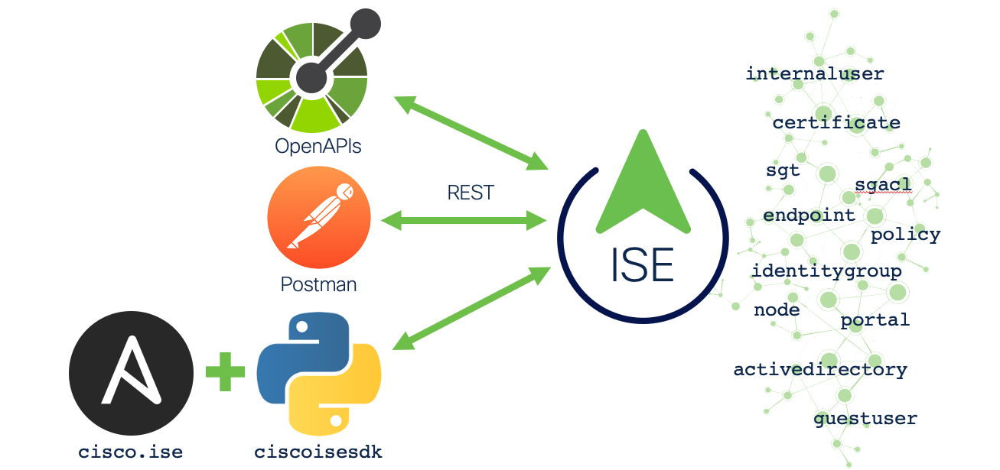

# ISE APIs, Ansible, and Automation Webinar

These examples were created for the Cisco Identity Services Engine (ISE) Webinar: **ISE 3.1 APIs, Ansible, and Automation** delivered on July 6, 2021. 




## Quick Start

Clone this repository to your local lab or sandbox environment :  
```bash
git clone https://github.com/1homas/APIs_Ansible_Automation_ISE_Webinar.git
```

Install Python 3.9 (tested with 3.9.5) :  

```bash
sudo apt install python3.9.5
```

Use the latest version of PIP :  

```bash
pip3 install --upgrade pip
```

Use a virtual environment for Python :  

```bash
pipenv install --python 3.9
pipenv shell
python --version        # Python 3.9.5+
```

Install the `ciscoisesdk`, `ansible`, and `jmespath` Python packages :  

```bash
pipenv install ciscoisesdk
pipenv install ansible
pipenv install jmespath
```

Install the `cisco.ise` Ansible collection:  

```bash
ansible-galaxy collection install cisco.ise
```

Install the `community.general` Ansible collection to take advantage of `json_query` and other filters :  

```bash
ansible-galaxy collection install community.general
```

To install a specific version of the `cisco.ise` collection, use `:` followed by range identifiers (`*` (latest/default), `!=`, `==`, `>=`, `>`, `<=`, `<`)

```bash
ansible-galaxy collection install cisco.ise:==0.0.7
```

To check for upgrades to the `cisco.ise` Ansible collection, use :  

```bash
ansible-galaxy collection install cisco.ise --upgrade
```

View the list of installed Ansible modules and versions :  

```bash
ansible-galaxy collection list
```


## Environment

Source the `source_me.sh` file to set the prompt and a few environment variables to ignore some warnings.

```bash
source source_me.sh
```


## Cisco DevNet Sandbox

If want a lab environment to try API, Python scripting, or Ansible with ISE, you may use the Cisco DevNet Sandbox [ISE with Ansible Automation](https://devnetsandbox.cisco.com/RM/Diagram/Index/ad4bb2ae-bb67-4d93-9f0d-2a6a04792e2e?diagramType=Topology) for free! It is the same sandbox used for the Learning Lab below so you can try this repository or your own projects!


## [ISE APIs, Ansible, and Automation DevNet Learning Lab](https://developer.cisco.com/learning/modules/ise-automation)
An overview of using REST APIs, OpenAPIs, Postman, and Ansible for Automation with ISE. If you want a lab to help you understand everything in this repository, this is your best place to start!
6 Learning Labs / 2 Hours
- **ISE APIs, Ansible, and Automation Overview**  🕓 20 min: - An overview of using REST APIs, OpenAPIs, Postman, and Ansible for Automation with ISE
- **ISE REST APIs** 🕓 20 min: Learn about the ISE REST APIs
- **ISE and Postman: Part 1**  🕓 20 min: Use Postman to interact with the ISE APIs. Use a workspace, customize a collection, and use environments
- **ISE and Postman: Part 2**  🕓 20 min: Import ISE collections in Postman, create a user, work with Active Directory, and add endpoints
- **ISE and Python**  🕓 20 min: Use Python to interact with the ISE APIs 
- **ISE and Ansible**  🕓 20 min: Use Ansible to manage and automate ISE.


## License

The examples in this repository are licensed under the [Cisco Sample Code License](https://developer.cisco.com/site/license/cisco-sample-code-license/).


